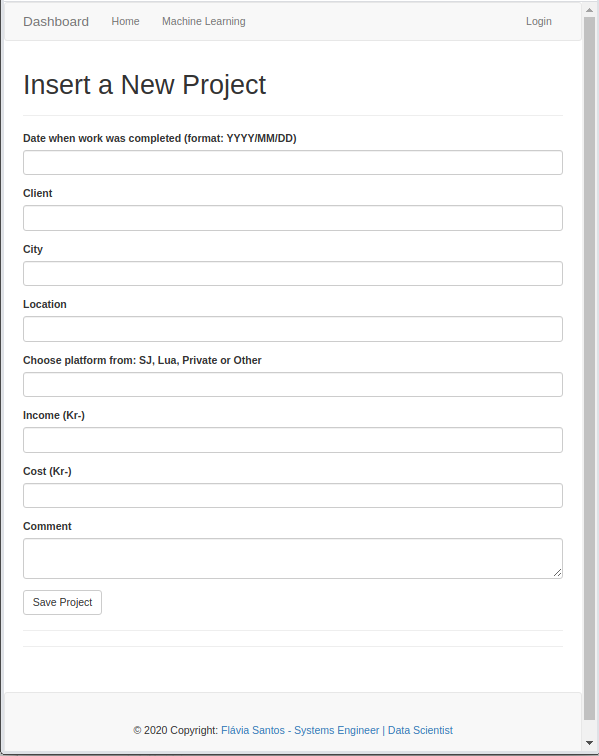

# Welcome to the Machine Learning Dashboard!

A end to end project from data collection to putting a machine learning model into production.
The application is available at [flavia-dashboard-ml.herokuapp.com]( https://flavia-dashboard.herokuapp.com).



### Dashboard Features
- SQLite, PostgreSQL, SQLAlchemy ORM
- Alembic (DB schema migrations)
- Modular design with Blueprints
- Session-Based authentication (via flask_login)
- Forms validation
- Deployment scripts: Docker

### Product technology stack
- Used Language: [Python3](https://www.python.org/)
- Web Framework: [Flask](https://www.palletsprojects.com/p/flask/)

<br />

## How to use it

```bash
$ # Get the code
$ git clone https://github.com/flaviassantos/dashboard.git
$ cd dashboard
$
$ # Virtualenv modules installation (Unix based systems)
$ virtualenv --no-site-packages venv
$ source venv/bin/activate
$
$ # Virtualenv modules installation (Windows based systems)
$ # virtualenv --no-site-packages venv
$ # .\venv\Scripts\activate
$
$ # Install modules
$ pip install -r requirements.txt
$
$ # Set the FLASK_APP environment variable
$ (Unix/Mac) export FLASK_APP=dashboard.py
$ (Windows) set FLASK_APP=dashboard.py
$ (Powershell) $env:FLASK_APP = ".\dashboard.py"
$
$ # Start the application
$ flask run
$
$ # Access the monitor in browser: http://127.0.0.1:5000/
```
<br />

## Docker
The documentation is available on [Docker hub](https://hub.docker.com/repository/docker/flaviassantos/dashboard).
If you have docker installed, you can test the code locally with:

```
$ docker pull flaviassantos/dashboard:latest

$ docker build -t dashboard:latest .

$ docker run --name dashboard -d -p 8000:5000 --rm -e SECRET_KEY=my-secret-key \
    -e MAIL_SERVER=smtp.googlemail.com -e MAIL_PORT=587 -e MAIL_USE_TLS=true \
    -e MAIL_USERNAME=<email@gmail> -e MAIL_PASSWORD=<email-password> \
    --link mysql:dbserver \
    -e DATABASE_URL=mysql+pymysql://dashboard:<database-password>@dbserver/dashboard 
    --link elasticsearch:elasticsearch 
    -e ELASTICSEARCH_URL=http://elasticsearch:9200 dashboard:latest

```

The application is then available on http://127.0.0.1:5000/ in your web browser.


<br />

```
@misc{Flavia: 2020,
  Author = {Flavia Santos},
  Title = {Oslo Bysykkel Monitor},
  Year = {2020},
  Publisher = {GitHub},
  Journal = {GitHub repository},
  Howpublished = {\url{https://github.com/flaviassantos/oslo-bysykkel-monitor.git}}
}
```